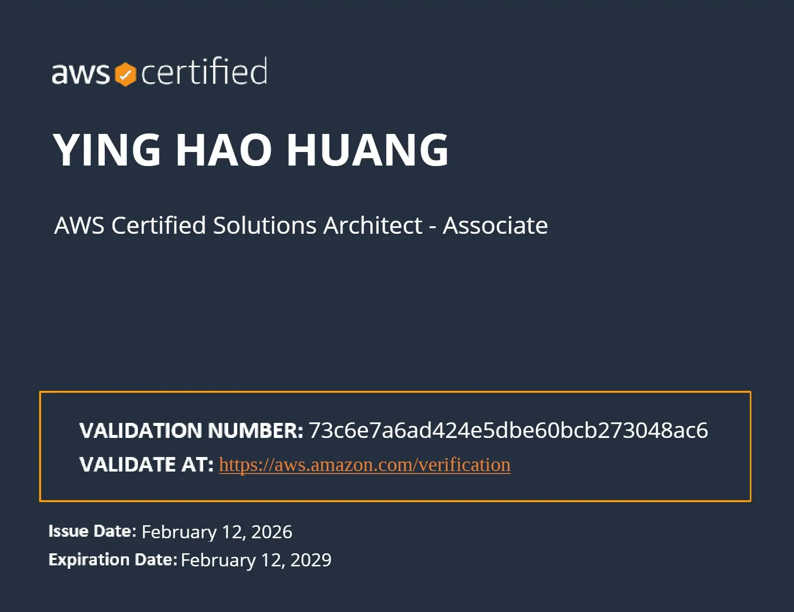

## 為什麼想考這張證照？

原本在猶豫要不要寫這篇心得，畢竟這是第一次自掏腰包報名考照，總覺得有點壓力。但時隔一個月回頭看，這段過程還是很值得記錄下來。

由於工作上接觸 AWS，除了實作經驗，我想能透過考照來提升能力，準備時間只有 2 個月。在這個 AI 飛速發展的時代，擁有一張雲端架構師證照，或許也是一種避免被 AI 取代的「防禦性生存」策略。

目前 AWS 助理級（Associate）證照共有 5 張：

- **SAA-C03 (Architect)**：最熱門，重點在於設計高可用性且具成本效益的架構。
- **DVA-C02 (Developer)**：專注於應用程式的編寫、測試與部署。
- **SOA-C03 (CloudOps)**：側重於系統的部署、維運與管理。
- **DEA-C01 (Data Engineer)**：專注數據管道、轉換與模型設計。
- **MLA-C01 (Machine Learning)**：驗證機器學習解決方案的實作技能。

考量到含金量與職場泛用性，我最終選擇了最核心的 SAA (Solutions Architect – Associate)。至於為什麼跳過基礎（Foundational）或直攻高級（Professional）？因為基礎對我來說過於簡單，而高級我又沒把握在 2 個月內通關。

## 精簡有效的學習資源

我主要依靠這兩項資源，建議「先觀念、後刷題」：

### 1. Udemy - Stephane Maarek 的 SAA 課程

- **評價**：講義架構清晰、淺顯易懂，非常適合用來打地基。
- **注意**：只看課程是遠遠不夠的，課程內容屬於「大方針」，考試細節需要靠刷題補足。

### 2. Tutorials Dojo (TD) 模擬考題

- **評價**：魔鬼訓練營。總共 8 個題庫（520 題），TD 題目非常刁鑽且充滿陷阱，每個選項描述都很接近。
- **心得**：寫完前三個題庫時信心大受打擊，一度懷疑自己到底有沒有學進去。但我堅持每錯一題就翻筆記複習，確保不是死記，而是理解背後的邏輯。

## 實戰心法：關於考試這件事

SAA 考試共 65 題，每一題的敘述跟選項都非常長。

> 💡 **關鍵技巧：抓關鍵字**  
> SAA 考的是「哪個選項更具性價比 (Cost-Effective)」或「更符合最佳實務」，例如：選項 A 和選項 B 都可以解決問題，但是選項 B 更具性價比，所以答案是 B。

另外，強烈建議非英文母語人士申請 **ESL 延長 30 分鐘**考試時間。這多出來的半小時，在面對落落長的題目真的是救命稻草！

## 考試當天

我選擇實體考試，不想應付線上考試對環境的嚴苛要求。大台北地區有很多選擇，我這次是在 iSpan（資展國際） 應考。

- **日期**：2026/02/12(四) 下午 2點
- **地點**：台北市復興南路一段 390 號 2 樓
- **報名**：這裡只開放週二、週四，建議至少提前一個月預約。
- **現場流程**：提早 15 分鐘報到即可。入場檢查非常嚴格，口袋、襪子都會仔細確認，基本上絕無作弊可能。
- **難度體感**：TD 題目 > 真題。觀念覆蓋率大約 80%，如果在 TD 刷題能穩定過關，正式考試應該沒問題。

## 後續與展望

當天下午考完，晚上就收到合格通知信了！拿到證照的那一刻，除了如釋重負，更多的是對雲端架構有了更完整的藍圖。

下一個目標還在考慮要考「旁系」 DVA 還是「直系」向上挑戰 SAP。唯一能確定的是，拿到這張 SAA 後，下次考試有 50% 的折扣卷可以用了，不考白不考！

希望這篇心得能幫到同樣想考 AWS 證照的朋友。最後附上證照：

